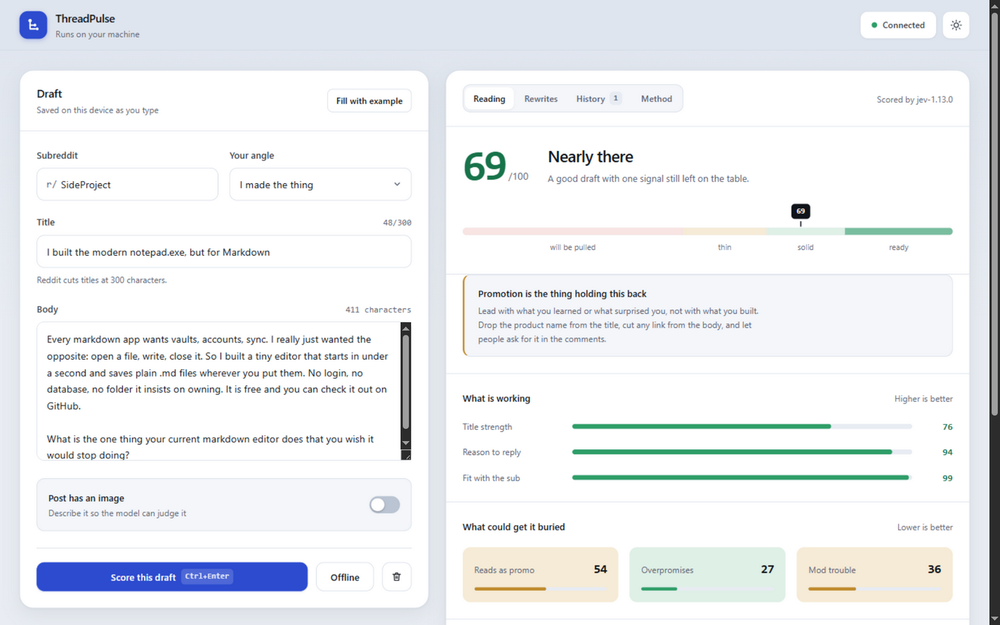
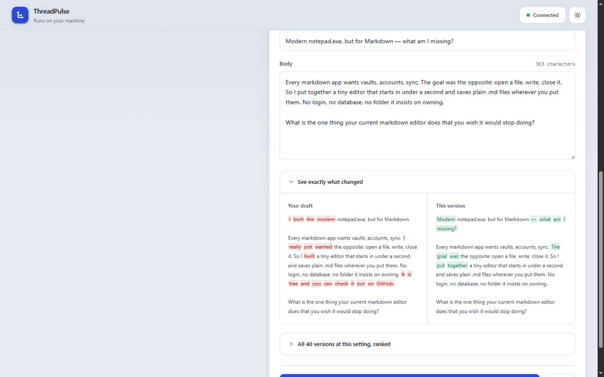
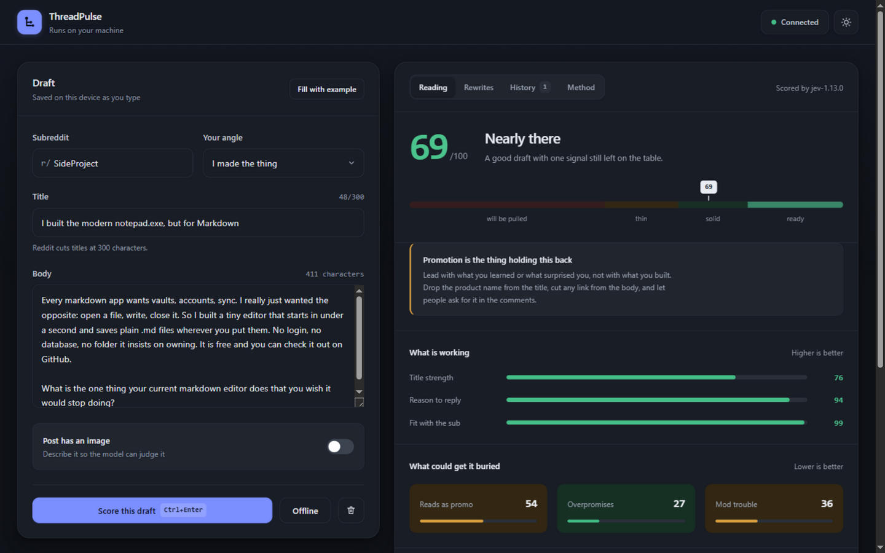

<div align="center">


# ThreadPulse

**Score a Reddit draft before you post it — then rewrite it and watch the number move.**

One file · No install · Nothing leaves your machine

**[Try the hosted demo](https://razee4315.github.io/ThreadPulse/)** — the full UI running on a local
heuristic in your browser. The real model judgement needs the tiny relay server this app ships with,
so run it locally for genuine scores.


</div>

---

ThreadPulse is a single `.mjs` file that runs a tiny local server and a full app in your browser.
Paste a draft, and a TypeSafe model judges it with eight independent judgements — how strong the
title is, whether anyone has a reason to reply, how it fits the sub, and whether it reads as
promotion or will trip a moderator. It also rewrites your draft a hundred and twenty ways, built
from your own sentences, and shows you exactly what changed.



## Quick start

```bash
node threadpulse.mjs
```

1. Open **http://localhost:8787**
2. Paste your TypeSafe API key — it stays in your browser and is sent only to TypeSafe
3. Write a draft and hit **Score this draft** — or press **Offline** for a keyless local estimate

> Different port? `node threadpulse.mjs --port 9000`

## Rewrites, measured

Switch to **Rewrites** and ThreadPulse assembles a dozen title treatments and ten body treatments
from *your own sentences*, combines them into ~120 complete posts, ranks them, and re-scores the
best three in full. Every version shows how much it changed, and a word-level diff shows exactly
where:



Three change settings — **Light touch**, **Rebalance**, **Rewrite hard** — are thirds of the change
actually achieved on your draft, so none of them is ever empty, and switching between them
re-ranks instantly.

## The arithmetic

```
quality = 0.34·title + 0.34·reply + 0.32·fit
risk    = 0.42·promo + 0.25·overpromise + 0.33·mod
score   = quality × (1 − 0.55·risk)
```

Risk multiplies instead of adds: the thing that gets a post deleted is the thing that moves the
number. If the model judges promotion above 0.78 or moderation risk above 0.68, the score is
capped at 40 — a post likely to be removed should not be able to score 78.

## Dark mode, history, offline



- **History** keeps your last 30 runs on this device, so you can watch the score move as you tune
- **Offline mode** runs a local heuristic — no key, no network, rewrites included
- **Ctrl+Enter** scores the draft, **1–4** switches tabs
- Everything survives a refresh: your draft, key, and history live in `localStorage`

## Privacy

Your API key, drafts, and run history never leave your machine — the bundled server only relays
requests to TypeSafe's API and keeps no logs. Images stay in the page: only the description you
write about them is scored. No analytics, no telemetry, no dependencies.

## Deploying it somewhere shared

There's no hosted demo *with real scores* on purpose — TypeSafe's API doesn't allow browser calls
from other sites (CORS), so the app needs its tiny server next to it, wherever it runs. Three ways
to put it somewhere:

- **GitHub Pages** — the included workflow deploys the UI as a
  [hosted demo](https://razee4315.github.io/ThreadPulse/) that scores with the local heuristic.
  The page detects the missing relay itself and labels it; no key is ever entered there
- **Render** — the button below reads the included `render.yaml` and stands up a free service
  with the real model behind it

[](https://render.com/deploy?repo=https://github.com/Razee4315/ThreadPulse)

- **Docker** — anywhere containers run:
  `docker build -t threadpulse . && docker run -p 8787:8787 threadpulse`

Any hosted copy holds no key and stores nothing — every visitor brings their own TypeSafe key,
which stays in *their* browser exactly as it does locally.

## License

[MIT](LICENSE)
